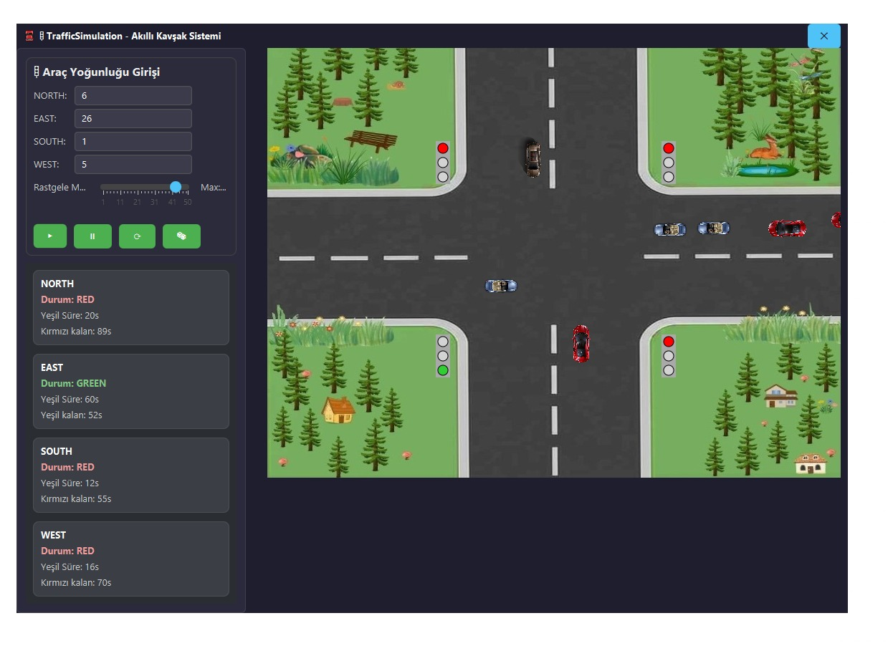

# 🚦 TrafficSimulation – Trafik Işığı Simülasyonu Projesi

Akıllı Kavşak Yönetimi | BZ214 Visual Programming Proje Ödevi  
Yoğunluk tabanlı dinamik ışık kontrolü ile gerçek zamanlı araç simülasyonu.

---

## 📂 Proje Dizini

```
src/main/java/
├── controller/      → Tüm mantıksal yöneticiler (simülasyon, ışık, araç vb.)
├── model/           → Veri sınıfları ve enum yapıları (Vehicle, Light, Direction vs.)
├── util/            → Sabitler, yardımcı hesaplayıcılar
├── view/            → JavaFX ile çizim yapan sınıflar (arayüz, render katmanı)
├── png/             → Araç görselleri (ileride kullanılacak)
resources/
└── app.css          → JavaFX sahne teması
```

---

## 🎯 Proje Amacı

- Kullanıcının verdiği araç yoğunluklarına göre ışık sürelerini hesaplar
- Her yönden araçlar doğarak trafik akışı simülasyonu gerçekleştirir
- Araçlar ışıklara göre durur/ilerler; çakışma engellenir
- Görsel olarak ışıkların durumu sahnede yansıtılır

---

## ⚙️ Temel Özellikler

| Özellik              | Açıklama |
|----------------------|----------|
| 🧭 Dört yönlü kavşak | North, South, East, West yönlerinden araçlar |
| 🚗 Araç üretimi      | Her saniye sırayla her yön için araç oluşturulur |
| 🚦 Işık hesaplama    | 120 saniyelik döngüde, araç yoğunluğuna orantılı yeşil süre |
| 🟥🟡🟢 Işık durumu     | Işıklar gerçek zamanlı olarak renk değiştirir ve sahnede görünür |
| ⏸️ Başlat / Durdur  | Simülasyon kontrol paneli ile start / pause / reset yapılabilir |
| 🧠 MVC mimarisi      | Modüler, okunabilir ve genişletilebilir yapı |

---

## 🧱 Mimari Yapı (MVC)

### Model:
- `Vehicle`, `TrafficLight`, `Direction`, `LightState`, `CarModel`

### Controller:
- `TrafficSimulationManager` → Tüm sistemi yöneten ana sınıf
- `VehicleSimulationManager` → Zamanlı araç üretimi ve yönetimi
- `TrafficLightController` → Işık geçişlerinin hesaplanması ve durumu
- `VehicleController` → Araçların hareketi, ışık ve çarpışma kontrolü

### View:
- `MainScene` → Sahne düzeni ve çerçeve
- `VehicleRenderer` → Araçları çizer
- `TrafficLightRenderer` → Işıkları çizer
- `SimulationControlPanel` → Kullanıcı kontrol paneli
- `IntersectionRenderer` → Kavşak arka plan çizimi

---

## 🖼️ Görsel Geliştirmeler (Planlandı)

| Alan              | Yapılacak |
|-------------------|-----------|
| 🚗 Araç görselleri | Gerçek görsellerle (PNG) değiştirilecek — `png/` dizininde hazır |
| 🛣️ Arka plan       | Daha gerçekçi yol dokusu ve kavşak geometrisi |
| 🌗 Işık animasyonları | Işık geçiş efektleri ve UI geri bildirimi |
| 📈 Gözlem paneli   | Her yöndeki anlık araç sayısı, bekleyen araç sayısı (TrafficObserverPanel) |

---

## 🧪 Test

- Her yön için araç sayısı manuel olarak girilir
- Simülasyon başlatıldığında ışık süreleri orantılı şekilde hesaplanır
- Araçlar sadece ışık yeşilken geçer, kırmızı/yellow ise bekler
- Işıklar sahnede gerçek renkleriyle gösterilir
- Başlat / duraklat / sıfırla kontrolleri doğru çalışır

---

## 📌 Kurulum

### 1. Gereksinimler
- Java 17 veya üzeri (JDK 21 önerilir)
- JavaFX destekli IDE (örneğin IntelliJ IDEA)
- Maven 3.6+ (otomatik bağımlılık yönetimi için)

### 2. Çalıştırma
Terminal veya komut satırından proje dizinine gelip:
```bash
mvn clean javafx:run
```

Alternatif: `view.Main.java` dosyasını doğrudan çalıştırabilirsiniz.
⚠️ Not: Eğer sisteminiz Windows dışı ise pom.xml içindeki <classifier>win</classifier> satırlarını kendi platformunuza göre mac veya linux olarak değiştirin.
IntelliJ IDEA ile Çalıştırma
Projeyi açın

pom.xml dosyasını otomatik olarak yükletin

view.Main sınıfına sağ tıklayıp Run 'Main.main()' deyin

Maven hedefi olarak javafx:run da çalıştırılabilir.
---

## 🚧 Planlanan Geliştirmeler

- CarModel üzerinden farklı tip/model görsellerin atanması
- Kavşak optimizasyonu (dönüşlü akış, öncelik kuralları)
- Gerçek zamanlı veri girişi ve otomatik yoğunluk simülasyonu
- Detaylı araç durumu: bekleme süresi, hız profili, yön vb.
- Export sistemi: JSON log, CSV çıktı alma

---

## 👥 Katkı / Ekip

Bu proje **BZ214 - Visual Programming** dersi kapsamında geliştirilmiştir.  
Kodlar modülerdir, katkıya açıktır. Katkı yaparken `controller/`, `model/`, `view/` ayrımına dikkat edilmesi önerilir.

---

## 🧠 Notlar

- Simülasyon mantığı doğru ve modüler bir şekilde çalışmaktadır
- Arayüz sade tutulmuştur, geliştirmeye açıktır
- Kod yapısı OOP prensiplerine uygun olarak soyutlanmıştır
- Proje IntelliJ IDEA + Maven uyumludur
